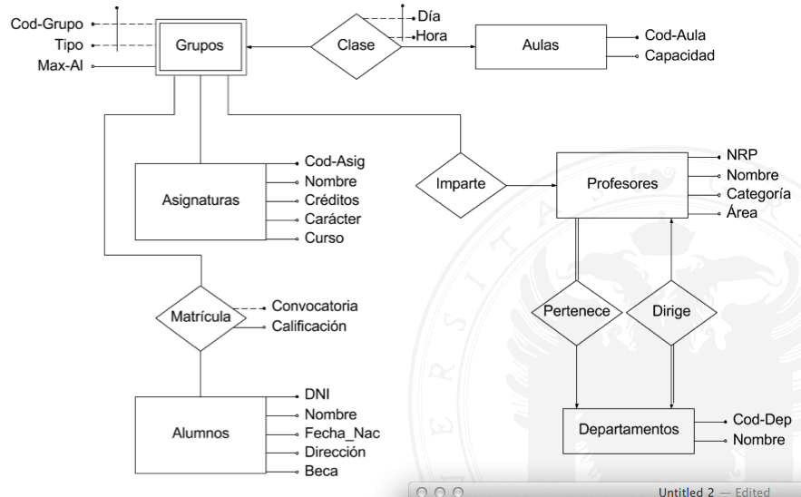
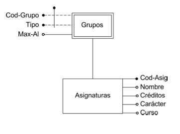

# Fundamentos de Bases de Datos


Documentación y Material ADICIONAL de la asignatura de Fundamentos de Bases de Datos. En este repositorio se incluirá toda la információn EXTRA de la asignatura que ayudará a su estudio y trabajo tanto para la parte de Teoría como para la parte de Prácticas.

Grado en Ingeniería Informática. Universidad de Granada.

Profesor Grupo A-A1: Manuel Parra-Royón  (manuelparra@cern.ch | manuelparra@ugr.es)

<HR>
	Tabla de Contenido
<HR>	

- [Fundamentos de Bases de Datos](#fundamentos-de-bases-de-datos)
  * [Traspaso de Modelo E/R a Tablas](#traspaso-de-modelo-e-r-a-tablas)
    + [Traspaso de Entidades Fuertes (algoritmo)](#traspaso-de-entidades-fuertes--algoritmo-)
    + [Traspaso de Entidades Débiles (algoritmo)](#traspaso-de-entidades-d-biles--algoritmo-)
    + [Traspaso de Relaciones (algoritmo)](#traspaso-de-relaciones--algoritmo-)

## Traspaso de Modelo E/R a Tablas

Para concretar los pasos para hacer el paso de Modelo de E/R (diagrama) a paso a tablas, vamos a trabajar con el diagrama siguiente:



El procedimiento general para pasar a tablas un diagrama de un Modelo de E/R es el siguiente:

### Traspaso de Entidades Fuertes (algoritmo)

1.- Vemos cuales son las Entidades Fuertes del Modelo E/R:
 - a) Anotamos cada una de las **entidades fuertes**.
 - b) Incluimos todos sus atributos.
 - c) Marcar el/los atributo/s que son Clave Primaria (**CP**)

Por tanto para le diagrama las Entidades Fuertes con los atributos y claves primarias son las siguientes: 

```
Asignaturas(Cod_asig,...);  

Aulas(Cod_aula,...);

Alumnos(DNI,...);

Profesores(NRP,...);

Departamentos(Cod_dep,...);
```


### Traspaso de Entidades Débiles (algoritmo)

2.- Vemos cuales son las de entidades débiles del diagrama de E/R:
 - a) Anotamos todas  las entidades débiles.
 - b) Incluimos los atributos que son Clave Primaria de la entidad debil.
 - c) Buscamos en las Entidades Fuertes con las que está unida la relación:
 - c1) Anotamos  los atributos que son Clave Primara en las Entidades Fuertes conectadas.
 
```
Asignaturas(Cod_asig,...)
Grupos(Cod_asig, Cod_grupo, Tipo,...)
```





### Traspaso de Relaciones (algoritmo)

3.- Tradución del conjunto de relaciones del modelo E/R:
 - a) Anotamos todas las relaciones que unen a las entidades.
 - b) Incluimos los atributos propios de la relación.
 - c) Añadimos los atributos de las claves primarias de las entidades que están conectadas.
	
A tener en cuenta:
 - **Si la relación es muchos a muchos**:
	- La clave primaria está formada por todos los atributos de las Entidades involucradas
 - **Si la relación es mucho a uno**:
	- La clave primaria está formada por todos los atributos de las Entidades con cardinalidad de tipo *muchos*.
 - **Relaciones uno a uno**:
	- Tiene al menos dos claves candidatas (de las relaciones involucradas). Pero hay que seleccionar una como clave primaria y otra como clave candidata.


